# PALECO CRM Database Entity-Relationship Diagram (ERD) & Schema Specification

**Document Date:** October 10, 2026  
**System:** PALECO Consumer Relations Management & Field Dispatching System (OTRS-CRM)  
**Database Engine:** MySQL 8.0+ / MariaDB 10.5+ (InnoDB Engine)  
**Character Set / Collation:** `utf8mb4` / `utf8mb4_unicode_ci`

---

## 1. Architectural Design & Philosophy

The PALECO CRM database utilizes a **Hybrid Identifier Strategy**:
1. **Universally Unique Lexicographically Sortable Identifiers (ULID - 26-char string):**
   - Applied to **high-cardinality distributed entities** and records that interact with mobile apps and cross-system integrations (`tickets`, `users`, `teams`, `consumers`, `ticket_endorsements`, `ticket_remarks`).
   - **Benefits:**
     - 128-bit security prevents enumeration and ID-scraping attacks.
     - Lexicographically sortable by creation timestamp (embedded 48-bit UNIX time), maintaining B-Tree index locality and avoiding InnoDB table clustering fragmentation.
     - Mobile clients can generate IDs in offline mode without collision when synced later.
2. **Auto-Incrementing BigIntegers (`BIGINT UNSIGNED`):**
   - Applied to **lookup tables, append-only logs, and tight child entity tables** (`departments`, `account_roles`, `team_roles`, `ticket_categories`, `ticket_status_logs`, `ticket_assignments`, `ticket_accomplishments`, `accomplishment_photos`, `personal_access_tokens`).
   - **Benefits:** Compact footprint (8 bytes) minimizes index tree overhead for high-frequency logs and lookup operations.
3. **Foreign Key Integrity & Naming Uniformity:**
   - **100% Column Naming Uniformity:** Every relational foreign key strictly follows the `[entity]_id` naming convention (e.g., `created_by_id`, `changed_by_id`, `assigned_by_id`, `reviewed_by_id`, `parent_ticket_id`).
   - **Referential Integrity:** All foreign keys are explicitly enforced via foreign key constraints (`constrained()`) with deliberate cascade policies (`cascadeOnDelete()` vs `nullOnDelete()`).

---

## 2. Visual Entity-Relationship Diagram (Mermaid)

```mermaid
erDiagram
    ACCOUNT_ROLES ||--o{ USERS : "defines system role for"
    DEPARTMENTS ||--o{ USERS : "houses staff members in"
    DEPARTMENTS ||--o{ TEAMS : "manages crews in"
    DEPARTMENTS ||--o{ TICKETS : "assigned to department"
    DEPARTMENTS ||--o{ TICKET_ENDORSEMENTS : "suggested endorsement target"
    TEAM_ROLES ||--o{ TEAM_MEMBERS : "designates crew function"
    
    USERS ||--o{ TEAM_MEMBERS : "participates in"
    TEAMS ||--o{ TEAM_MEMBERS : "composed of"
    
    CONSUMERS ||--o{ TICKETS : "reported by / linked to"
    TICKET_CATEGORIES ||--o{ TICKETS : "categorizes complaint"
    TEAMS ||--o{ TICKETS : "currently assigned to"
    USERS ||--o{ TICKETS : "created by (dispatcher/staff)"
    TICKETS ||--o{ TICKETS : "parent spawns child tickets"
    
    TICKETS ||--o{ TICKET_STATUS_LOGS : "tracks status changes"
    USERS ||--o{ TICKET_STATUS_LOGS : "changed by"
    
    TICKETS ||--o{ TICKET_ASSIGNMENTS : "tracks assignment history"
    TEAMS ||--o{ TICKET_ASSIGNMENTS : "assigned to team"
    USERS ||--o{ TICKET_ASSIGNMENTS : "assigned by supervisor"
    
    TICKETS ||--o{ TICKET_ENDORSEMENTS : "requests department transfer"
    USERS ||--o{ TICKET_ENDORSEMENTS : "created by supervisor"
    USERS ||--o{ TICKET_ENDORSEMENTS : "reviewed by CWD officer"
    
    TICKETS ||--o{ TICKET_ACCOMPLISHMENTS : "documents field completion"
    USERS ||--o{ TICKET_ACCOMPLISHMENTS : "accomplished by field worker"
    USERS ||--o{ TICKET_ACCOMPLISHMENTS : "approved by supervisor"
    USERS ||--o{ TICKET_ACCOMPLISHMENTS : "rejected by supervisor"
    
    TICKET_ACCOMPLISHMENTS ||--o{ ACCOMPLISHMENT_PHOTOS : "contains photo evidence"
    
    TICKETS ||--o{ TICKET_REMARKS : "discussion and internal notes"
    USERS ||--o{ TICKET_REMARKS : "authored by"
    
    USERS ||--o{ SESSIONS : "authenticated web session"
    USERS ||--o{ PERSONAL_ACCESS_TOKENS : "mobile API sanctum tokens"
    USERS ||--o{ IDEMPOTENCY_RECORDS : "initiates idempotent requests"

    ACCOUNT_ROLES {
        bigint id PK
        string role_name
        string slug_identifier
        timestamp created_at
        timestamp updated_at
    }

    DEPARTMENTS {
        bigint id PK
        string dept_name
        string dept_desc
        timestamp deleted_at
        timestamp created_at
        timestamp updated_at
    }

    TEAM_ROLES {
        bigint id PK
        string role_name
        string slug_identifier
        timestamp created_at
        timestamp updated_at
    }

    CONSUMERS {
        char id PK "ULID"
        string acct_no "UK"
        string acct_code "UK"
        string name
        string address
        string status
        string meter_serial
        timestamp deleted_at
        timestamp created_at
        timestamp updated_at
    }

    USERS {
        char id PK "ULID"
        string username "UK"
        string first_name
        string middle_name
        string last_name
        string name_ext
        string email "UK"
        string contact
        bigint role_id FK
        bigint department_id FK
        string password
        tinyint is_active
        timestamp last_login
        timestamp locked_until
        timestamp created_at
        timestamp updated_at
    }

    TEAMS {
        char id PK "ULID"
        string team_name
        string team_desc
        time shift_start
        time shift_end
        bigint department_id FK
        timestamp deleted_at
        timestamp created_at
        timestamp updated_at
    }

    TEAM_MEMBERS {
        char user_id PK,FK "ULID"
        char team_id PK,FK "ULID"
        bigint team_role_id FK
        timestamp created_at
        timestamp updated_at
    }

    TICKET_CATEGORIES {
        bigint id PK
        string category_name
        string category_desc
        timestamp deleted_at
        timestamp created_at
        timestamp updated_at
    }

    TICKETS {
        char id PK "ULID"
        string ticket_number "UK"
        char parent_ticket_id FK "ULID"
        char consumer_id FK "ULID"
        string consumer_contact
        string complaint_source
        text complaint_description
        bigint category_id FK
        boolean other_category
        string other_category_name
        string purok
        string street
        string barangay
        string landmark
        bigint department_id FK
        char team_id FK "ULID"
        char created_by_id FK "ULID"
        string status
        boolean is_offline_synced
        timestamp synced_at
        timestamp reported_at
        timestamp started_at
        timestamp client_started_at
        timestamp resolved_at
        timestamp closed_at
        timestamp deleted_at
        timestamp created_at
        timestamp updated_at
    }

    TICKET_STATUS_LOGS {
        bigint id PK
        char ticket_id FK "ULID"
        char changed_by_id FK "ULID"
        string old_status
        string new_status
        timestamp created_at
        timestamp updated_at
    }

    TICKET_ASSIGNMENTS {
        bigint id PK
        char ticket_id FK "ULID"
        char team_id FK "ULID"
        char assigned_by_id FK "ULID"
        text reason
        timestamp unassigned_at
        timestamp created_at
        timestamp updated_at
    }

    TICKET_ENDORSEMENTS {
        char id PK "ULID"
        char ticket_id FK "ULID"
        char created_by_id FK "ULID"
        bigint suggested_department_id FK
        text reason
        string status
        string pre_endorsement_status
        text rejection_reason
        char reviewed_by_id FK "ULID"
        timestamp reviewed_at
        timestamp created_at
        timestamp updated_at
    }

    TICKET_ACCOMPLISHMENTS {
        bigint id PK
        char ticket_id FK "ULID"
        char accomplished_by_id FK "ULID"
        text remarks
        string consumer_name
        string signature_path
        string status
        boolean is_offline_synced
        timestamp synced_at
        string idempotency_key
        timestamp accomplished_at
        timestamp client_accomplished_at
        char approved_by_id FK "ULID"
        char rejected_by_id FK "ULID"
        text rejection_reason
        timestamp created_at
        timestamp updated_at
    }

    ACCOMPLISHMENT_PHOTOS {
        bigint id PK
        bigint accomplishment_id FK
        string file_path
        string file_name
        int file_size
        string mime_type
        timestamp created_at
        timestamp updated_at
    }

    TICKET_REMARKS {
        char id PK "ULID"
        char ticket_id FK "ULID"
        char user_id FK "ULID"
        text body
        boolean is_internal
        timestamp created_at
        timestamp updated_at
    }

    IDEMPOTENCY_RECORDS {
        bigint id PK
        char user_id FK "ULID"
        string idempotency_key "UK (scoped)"
        string route_name
        string request_hash
        string status "in_progress | completed"
        int response_code
        json response_body
        timestamp expires_at
        timestamp created_at
        timestamp updated_at
    }

    PERSONAL_ACCESS_TOKENS {
        bigint id PK
        string tokenable_type
        char tokenable_id "ULID"
        text name
        string token "UK"
        text abilities
        timestamp last_used_at
        timestamp expires_at
        timestamp created_at
        timestamp updated_at
    }

    SESSIONS {
        string id PK
        char user_id FK "ULID"
        string ip_address
        text user_agent
        longtext payload
        int last_activity
    }
```

---

## 3. Data Dictionary: Core Tables & Relations

### Group 1: Core Organization & Access Control

#### `account_roles`
Lookup table defining application user access tiers.
| Column | Type | Nullable | Constraints / Default | Description |
| :--- | :--- | :---: | :--- | :--- |
| `id` | `BIGINT UNSIGNED` | No | `PRIMARY KEY AUTO_INCREMENT` | Role identifier. |
| `role_name` | `VARCHAR(255)` | No | `UNIQUE` | Display name (e.g. `Administrator`, `CWD Officer`, `Supervisor`, `Field Personnel`). |
| `slug_identifier` | `VARCHAR(255)` | No | `UNIQUE` | Programmatic slug (`admin`, `cwd_officer`, `supervisor`, `field_personnel`). |
| `created_at` | `TIMESTAMP` | Yes | `NULL` | Record creation timestamp. |
| `updated_at` | `TIMESTAMP` | Yes | `NULL` | Record update timestamp. |

#### `departments`
Operating business units of PALECO (e.g. CWD, Technical Services, Maintenance).
| Column | Type | Nullable | Constraints / Default | Description |
| :--- | :--- | :---: | :--- | :--- |
| `id` | `BIGINT UNSIGNED` | No | `PRIMARY KEY AUTO_INCREMENT` | Department identifier. |
| `dept_name` | `VARCHAR(255)` | No | — | Department title. |
| `dept_desc` | `VARCHAR(255)` | Yes | `NULL` | Operational description. |
| `deleted_at` | `TIMESTAMP` | Yes | `NULL` | Soft delete timestamp. |
| `created_at` | `TIMESTAMP` | Yes | `NULL` | Record creation timestamp. |
| `updated_at` | `TIMESTAMP` | Yes | `NULL` | Record update timestamp. |

#### `users`
Authenticated personnel across Web and Mobile applications.
| Column | Type | Nullable | Constraints / Default | Description |
| :--- | :--- | :---: | :--- | :--- |
| `id` | `CHAR(26)` | No | `PRIMARY KEY` (ULID) | Global unique user identifier. |
| `username` | `VARCHAR(255)` | No | `UNIQUE` | Unique login username. |
| `first_name` | `VARCHAR(255)` | No | — | Given name. |
| `middle_name` | `VARCHAR(255)` | Yes | `NULL` | Middle name. |
| `last_name` | `VARCHAR(255)` | No | — | Surname. |
| `name_ext` | `VARCHAR(255)` | Yes | `NULL` | Name extension (Jr., III). |
| `email` | `VARCHAR(255)` | Yes | `UNIQUE`, `NULL` | Electronic mail address. |
| `contact` | `VARCHAR(255)` | No | — | Mobile phone number. |
| `role_id` | `BIGINT UNSIGNED` | Yes | `FK -> account_roles(id) ON DELETE SET NULL` | Assigned role. |
| `department_id` | `BIGINT UNSIGNED` | Yes | `FK -> departments(id) ON DELETE SET NULL` | Parent department. |
| `password` | `VARCHAR(255)` | No | — | Bcrypt hashed password. |
| `is_active` | `TINYINT` | No | `DEFAULT 1` | Account activation flag. |
| `last_login` | `TIMESTAMP` | Yes | `NULL` | Last login timestamp. |
| `locked_until` | `TIMESTAMP` | Yes | `NULL` | Lockout expiration if throttled. |
| `created_at` | `TIMESTAMP` | Yes | `NULL` | Record creation timestamp. |
| `updated_at` | `TIMESTAMP` | Yes | `NULL` | Record update timestamp. |

#### `teams`
Operational dispatch crews assigned to field operations.
| Column | Type | Nullable | Constraints / Default | Description |
| :--- | :--- | :---: | :--- | :--- |
| `id` | `CHAR(26)` | No | `PRIMARY KEY` (ULID) | Global unique team identifier. |
| `team_name` | `VARCHAR(255)` | No | — | Name of field crew. |
| `team_desc` | `VARCHAR(255)` | Yes | `NULL` | Description of vehicle / specialization. |
| `shift_start` | `TIME` | No | — | Shift start time (HH:MM:SS). |
| `shift_end` | `TIME` | No | — | Shift end time (HH:MM:SS). |
| `department_id` | `BIGINT UNSIGNED` | Yes | `FK -> departments(id) ON DELETE SET NULL` | Department controlling this crew. |
| `deleted_at` | `TIMESTAMP` | Yes | `NULL` | Soft delete timestamp. |
| `created_at` | `TIMESTAMP` | Yes | `NULL` | Record creation timestamp. |
| `updated_at` | `TIMESTAMP` | Yes | `NULL` | Record update timestamp. |

#### `team_members`
Pivot table joining users to operational teams.
| Column | Type | Nullable | Constraints / Default | Description |
| :--- | :--- | :---: | :--- | :--- |
| `user_id` | `CHAR(26)` | No | `PRIMARY KEY (composite)`, `FK -> users(id) ON DELETE CASCADE` | Assigned personnel. |
| `team_id` | `CHAR(26)` | No | `PRIMARY KEY (composite)`, `FK -> teams(id) ON DELETE CASCADE` | Assigned team. |
| `team_role_id` | `BIGINT UNSIGNED` | No | `FK -> team_roles(id)` | Function within crew (Lead, Lineman, Driver). |
| `created_at` | `TIMESTAMP` | Yes | `NULL` | Assignment timestamp. |
| `updated_at` | `TIMESTAMP` | Yes | `NULL` | Record update timestamp. |

#### `consumers`
Electrical consumers / member-consumer accounts registered in PALECO.
| Column | Type | Nullable | Constraints / Default | Description |
| :--- | :--- | :---: | :--- | :--- |
| `id` | `CHAR(26)` | No | `PRIMARY KEY` (ULID) | Consumer record identifier. |
| `acct_no` | `VARCHAR(255)` | No | `UNIQUE` | Consumer account number. |
| `acct_code` | `VARCHAR(255)` | No | `UNIQUE` | Consumer meter account code. |
| `name` | `VARCHAR(255)` | No | — | Full consumer name. |
| `address` | `VARCHAR(255)` | No | — | Billing and connection address. |
| `status` | `VARCHAR(255)` | Yes | `NULL` | Connection status (Active, Disconnected). |
| `meter_serial` | `VARCHAR(255)` | Yes | `NULL` | Electric meter hardware serial. |
| `deleted_at` | `TIMESTAMP` | Yes | `NULL` | Soft delete timestamp. |
| `created_at` | `TIMESTAMP` | Yes | `NULL` | Record creation timestamp. |
| `updated_at` | `TIMESTAMP` | Yes | `NULL` | Record update timestamp. |

---

### Group 2: Ticket Lifecycle & Field Modules

#### `ticket_categories`
Classification of consumer issues (e.g. Power Outage, Fluctuating Voltage, Meter Defect).
| Column | Type | Nullable | Constraints / Default | Description |
| :--- | :--- | :---: | :--- | :--- |
| `id` | `BIGINT UNSIGNED` | No | `PRIMARY KEY AUTO_INCREMENT` | Category identifier. |
| `category_name` | `VARCHAR(255)` | No | — | Category display name. |
| `category_desc` | `VARCHAR(255)` | Yes | `NULL` | Detailed scope of category. |
| `deleted_at` | `TIMESTAMP` | Yes | `NULL` | Soft delete timestamp. |
| `created_at` | `TIMESTAMP` | Yes | `NULL` | Record creation timestamp. |
| `updated_at` | `TIMESTAMP` | Yes | `NULL` | Record update timestamp. |

#### `tickets`
The primary operational service request record.
| Column | Type | Nullable | Constraints / Default | Description |
| :--- | :--- | :---: | :--- | :--- |
| `id` | `CHAR(26)` | No | `PRIMARY KEY` (ULID) | Global unique ticket identifier. |
| `ticket_number` | `VARCHAR(30)` | No | `UNIQUE` | Human-readable tracking number (e.g. `TKT-261010-001`). |
| `parent_ticket_id` | `CHAR(26)` | Yes | `FK -> tickets(id) ON DELETE SET NULL` | Parent ticket if this is an endorsed child ticket. |
| `consumer_id` | `CHAR(26)` | Yes | `FK -> consumers(id) ON DELETE SET NULL` | Linked consumer account. |
| `consumer_contact` | `VARCHAR(20)` | Yes | `NULL` | Contact phone number. |
| `complaint_source` | `VARCHAR(30)` | No | — | Intake source (`walk_in`, `phone_call`, etc.). |
| `complaint_description` | `TEXT` | Yes | `NULL` | Comprehensive consumer narrative. |
| `category_id` | `BIGINT UNSIGNED` | Yes | `FK -> ticket_categories(id)` | Standard classification. |
| `other_category` | `TINYINT(1)` | No | `DEFAULT 0` | Flag if category is unspecified write-in. |
| `other_category_name` | `VARCHAR(255)` | Yes | `NULL` | Unspecified category custom label. |
| `purok` | `VARCHAR(255)` | Yes | `NULL` | Zone / Purok. |
| `street` | `VARCHAR(255)` | Yes | `NULL` | Street name. |
| `barangay` | `VARCHAR(255)` | No | — | Barangay locality. |
| `landmark` | `VARCHAR(255)` | Yes | `NULL` | Physical navigational landmark. |
| `department_id` | `BIGINT UNSIGNED` | Yes | `FK -> departments(id)` | Assigned handling department. |
| `team_id` | `CHAR(26)` | Yes | `FK -> teams(id)` | Currently assigned field crew. |
| `created_by_id` | `CHAR(26)` | No | `FK -> users(id)` | User who recorded the ticket. |
| `status` | `VARCHAR(30)` | No | `DEFAULT 'open'` | Lifecycle state (`open`, `assigned`, `in_progress`, `resolved`, `closed`, `pending_endorsement`, `endorsed`). |
| `is_offline_synced` | `TINYINT(1)` | No | `DEFAULT 0` | Flag: 1 if synchronized from offline store-and-forward outbox; 0 if live. |
| `synced_at` | `TIMESTAMP` | Yes | `NULL` | Ingestion timestamp when offline action was committed to cloud DB. |
| `reported_at` | `TIMESTAMP` | Yes | `NULL` | Intake timestamp. |
| `started_at` | `TIMESTAMP` | Yes | `NULL` | Field crew commencement timestamp (SLA effective start). |
| `client_started_at` | `TIMESTAMP` | Yes | `NULL` | Exact device event timestamp sent by mobile client upon work start. |
| `resolved_at` | `TIMESTAMP` | Yes | `NULL` | Field crew completion timestamp. |
| `closed_at` | `TIMESTAMP` | Yes | `NULL` | Final supervisor verification timestamp. |
| `deleted_at` | `TIMESTAMP` | Yes | `NULL` | Soft delete timestamp. |
| `created_at` | `TIMESTAMP` | Yes | `NULL` | Record creation timestamp. |
| `updated_at` | `TIMESTAMP` | Yes | `NULL` | Record update timestamp. |

**Indexes on `tickets`:**
- `idx_tickets_status` (`status`)
- `idx_tickets_reported_at` (`reported_at`)
- `idx_tickets_created_at` (`created_at`)
- `idx_tickets_closed_at` (`closed_at`)
- `idx_tickets_department_status` (`department_id`, `status`)
- `idx_tickets_team_status` (`team_id`, `status`)
- `idx_tickets_status_reported_at` (`status`, `reported_at`)

#### `ticket_status_logs`
Immutable audit log tracking all status transitions.
| Column | Type | Nullable | Constraints / Default | Description |
| :--- | :--- | :---: | :--- | :--- |
| `id` | `BIGINT UNSIGNED` | No | `PRIMARY KEY AUTO_INCREMENT` | Log entry ID. |
| `ticket_id` | `CHAR(26)` | No | `FK -> tickets(id) ON DELETE CASCADE` | Associated ticket. |
| `changed_by_id` | `CHAR(26)` | Yes | `FK -> users(id) ON DELETE SET NULL` | Officer/worker triggering transition. |
| `old_status` | `VARCHAR(30)` | Yes | `NULL` | Previous status state. |
| `new_status` | `VARCHAR(30)` | No | — | Resulting status state. |
| `created_at` | `TIMESTAMP` | Yes | `NULL` | Transition timestamp. |
| `updated_at` | `TIMESTAMP` | Yes | `NULL` | Record update timestamp. |

#### `ticket_assignments`
Assignment history tracking which team handled the ticket and when.
| Column | Type | Nullable | Constraints / Default | Description |
| :--- | :--- | :---: | :--- | :--- |
| `id` | `BIGINT UNSIGNED` | No | `PRIMARY KEY AUTO_INCREMENT` | Assignment ID. |
| `ticket_id` | `CHAR(26)` | No | `FK -> tickets(id) ON DELETE CASCADE` | Target ticket. |
| `team_id` | `CHAR(26)` | No | `FK -> teams(id) ON DELETE CASCADE` | Assigned team. |
| `assigned_by_id` | `CHAR(26)` | No | `FK -> users(id) ON DELETE CASCADE` | Supervisor making the assignment. |
| `reason` | `TEXT` | Yes | `NULL` | Contextual instructions / reassignment rationale. |
| `unassigned_at` | `TIMESTAMP` | Yes | `NULL` | Timestamp when reassigned or closed. |
| `created_at` | `TIMESTAMP` | Yes | `NULL` | Assignment commencement timestamp. |
| `updated_at` | `TIMESTAMP` | Yes | `NULL` | Record update timestamp. |

#### `ticket_endorsements`
Cross-departmental escalation and ticket handoff workflow.
| Column | Type | Nullable | Constraints / Default | Description |
| :--- | :--- | :---: | :--- | :--- |
| `id` | `CHAR(26)` | No | `PRIMARY KEY` (ULID) | Endorsement request identifier. |
| `ticket_id` | `CHAR(26)` | No | `FK -> tickets(id) ON DELETE CASCADE` | Parent ticket being endorsed. |
| `created_by_id` | `CHAR(26)` | No | `FK -> users(id) ON DELETE CASCADE` | Supervisor requesting endorsement. |
| `suggested_department_id` | `BIGINT UNSIGNED` | Yes | `FK -> departments(id) ON DELETE SET NULL` | Suggested destination department. |
| `reason` | `TEXT` | No | — | Endorsement rationale. |
| `status` | `VARCHAR(30)` | No | `DEFAULT 'pending'` | Endorsement status (`pending`, `approved`, `rejected`). |
| `pre_endorsement_status` | `VARCHAR(30)` | No | — | Ticket state before locking (e.g. `open`, `assigned`). |
| `rejection_reason` | `TEXT` | Yes | `NULL` | Officer rationale if rejected. |
| `reviewed_by_id` | `CHAR(26)` | Yes | `FK -> users(id) ON DELETE SET NULL` | CWD officer who verified endorsement. |
| `reviewed_at` | `TIMESTAMP` | Yes | `NULL` | Verification timestamp. |
| `created_at` | `TIMESTAMP` | Yes | `NULL` | Request creation timestamp. |
| `updated_at` | `TIMESTAMP` | Yes | `NULL` | Record update timestamp. |

#### `ticket_accomplishments`
Field accomplishment submission containing work summary and signature.
| Column | Type | Nullable | Constraints / Default | Description |
| :--- | :--- | :---: | :--- | :--- |
| `id` | `BIGINT UNSIGNED` | No | `PRIMARY KEY AUTO_INCREMENT` | Accomplishment report ID. |
| `ticket_id` | `CHAR(26)` | No | `FK -> tickets(id) ON DELETE CASCADE` | Subject ticket. |
| `accomplished_by_id` | `CHAR(26)` | No | `FK -> users(id) ON DELETE CASCADE` | Field personnel submitting report. |
| `remarks` | `TEXT` | No | — | Narrative of technical actions taken. |
| `consumer_name` | `VARCHAR(255)` | Yes | `NULL` | Name of consumer acknowledging work. |
| `signature_path` | `VARCHAR(255)` | Yes | `NULL` | Storage path to consumer digital signature image. |
| `status` | `VARCHAR(30)` | No | `DEFAULT 'pending'` | Supervisor review status (`pending`, `approved`, `rejected`). |
| `is_offline_synced` | `TINYINT(1)` | No | `DEFAULT 0` | Flag: 1 if submitted from offline store-and-forward outbox; 0 if live. |
| `synced_at` | `TIMESTAMP` | Yes | `NULL` | Ingestion timestamp when offline accomplishment was committed to cloud DB. |
| `idempotency_key` | `VARCHAR(64)` | Yes | `NULL` | Unique idempotency UUID from client preventing duplicate photo uploads. |
| `accomplished_at` | `TIMESTAMP` | No | — | Physical completion timestamp (SLA effective completion). |
| `client_accomplished_at` | `TIMESTAMP` | Yes | `NULL` | Exact device event timestamp sent by mobile client upon accomplishment. |
| `approved_by_id` | `CHAR(26)` | Yes | `FK -> users(id) ON DELETE SET NULL` | Supervisor who approved closure. |
| `rejected_by_id` | `CHAR(26)` | Yes | `FK -> users(id) ON DELETE SET NULL` | Supervisor who rejected report. |
| `rejection_reason` | `TEXT` | Yes | `NULL` | Deficiency rationale if rejected. |
| `created_at` | `TIMESTAMP` | Yes | `NULL` | Submission timestamp. |
| `updated_at` | `TIMESTAMP` | Yes | `NULL` | Record update timestamp. |

#### `idempotency_records`
Caches HTTP mutations for offline-asynchronous store-and-forward API operations.
| Column | Type | Nullable | Constraints / Default | Description |
| :--- | :--- | :---: | :--- | :--- |
| `id` | `BIGINT UNSIGNED` | No | `PRIMARY KEY AUTO_INCREMENT` | Record identifier. |
| `user_id` | `CHAR(26)` | No | `FK -> users(id) ON DELETE CASCADE` | Authenticated user who submitted the request. |
| `idempotency_key` | `VARCHAR(64)` | No | — | Client-generated UUIDv4 token. |
| `route_name` | `VARCHAR(255)` | No | — | Target API endpoint (e.g. `api.tickets.start`). |
| `request_hash` | `CHAR(64)` | No | — | SHA-256 fingerprint of URL and serialized payload. |
| `status` | `VARCHAR(20)` | No | `DEFAULT 'in_progress'` | Execution state (`in_progress`, `completed`). |
| `response_code` | `INT` | Yes | `NULL` | Cached HTTP status code (e.g. `200`, `201`). |
| `response_body` | `JSON` | Yes | `NULL` | Cached full JSON response payload. |
| `expires_at` | `TIMESTAMP` | No | — | TTL retention expiration timestamp (7 days). |
| `created_at` | `TIMESTAMP` | Yes | `NULL` | Initial request reception timestamp. |
| `updated_at` | `TIMESTAMP` | Yes | `NULL` | Record update timestamp. |

**Indexes on `idempotency_records`:**
- Unique compound index: `uk_user_idempotency` (`user_id`, `idempotency_key`)
- Index on TTL expiry: `idx_idempotency_expires` (`expires_at`)

#### `accomplishment_photos`
Photographic evidence attached to field accomplishment reports.
| Column | Type | Nullable | Constraints / Default | Description |
| :--- | :--- | :---: | :--- | :--- |
| `id` | `BIGINT UNSIGNED` | No | `PRIMARY KEY AUTO_INCREMENT` | Photo attachment ID. |
| `accomplishment_id` | `BIGINT UNSIGNED` | No | `FK -> ticket_accomplishments(id) ON DELETE CASCADE` | Associated accomplishment report. |
| `file_path` | `VARCHAR(255)` | No | — | Relative storage disk path. |
| `file_name` | `VARCHAR(255)` | Yes | `NULL` | Original client file name. |
| `file_size` | `INT UNSIGNED` | Yes | `NULL` | File size in bytes. |
| `mime_type` | `VARCHAR(50)` | Yes | `NULL` | MIME content type (e.g. `image/jpeg`). |
| `created_at` | `TIMESTAMP` | Yes | `NULL` | Upload timestamp. |
| `updated_at` | `TIMESTAMP` | Yes | `NULL` | Record update timestamp. |

#### `ticket_remarks`
Internal collaboration notes and discussion thread for a ticket.
| Column | Type | Nullable | Constraints / Default | Description |
| :--- | :--- | :---: | :--- | :--- |
| `id` | `CHAR(26)` | No | `PRIMARY KEY` (ULID) | Remark note ID. |
| `ticket_id` | `CHAR(26)` | No | `FK -> tickets(id) ON DELETE CASCADE` | Target ticket. |
| `user_id` | `CHAR(26)` | No | `FK -> users(id) ON DELETE CASCADE` | Note author. |
| `body` | `TEXT` | No | — | Content of note. |
| `is_internal` | `TINYINT(1)` | No | `DEFAULT 0` | 1 if internal staff-only; 0 if public. |
| `created_at` | `TIMESTAMP` | Yes | `NULL` | Creation timestamp. |
| `updated_at` | `TIMESTAMP` | Yes | `NULL` | Record update timestamp. |

**Indexes on `ticket_remarks`:**
- Composite index: (`ticket_id`, `created_at`)

---

## 4. Integrity Verification & Relational Cascade Rules

1. **Delete Cascade Safety:**
   - Deleting a `Ticket` cascades and purges dependent status logs, assignments, endorsements, accomplishments, remarks, and accomplishment photos.
   - Deleting a `User` does **NOT** drop tickets. It triggers `nullOnDelete()` on `changed_by_id`, `approved_by_id`, `rejected_by_id`, and `reviewed_by_id` to preserve historical audit continuity.
   - Deleting a `Department` soft-deletes (`deleted_at`), retaining referential linkages on historic tickets.
2. **ULID Standardization:**
   - All ULID columns are uniformly represented as `CHAR(26)` in MySQL, guaranteeing predictable storage and high-speed B-Tree index traversal.

