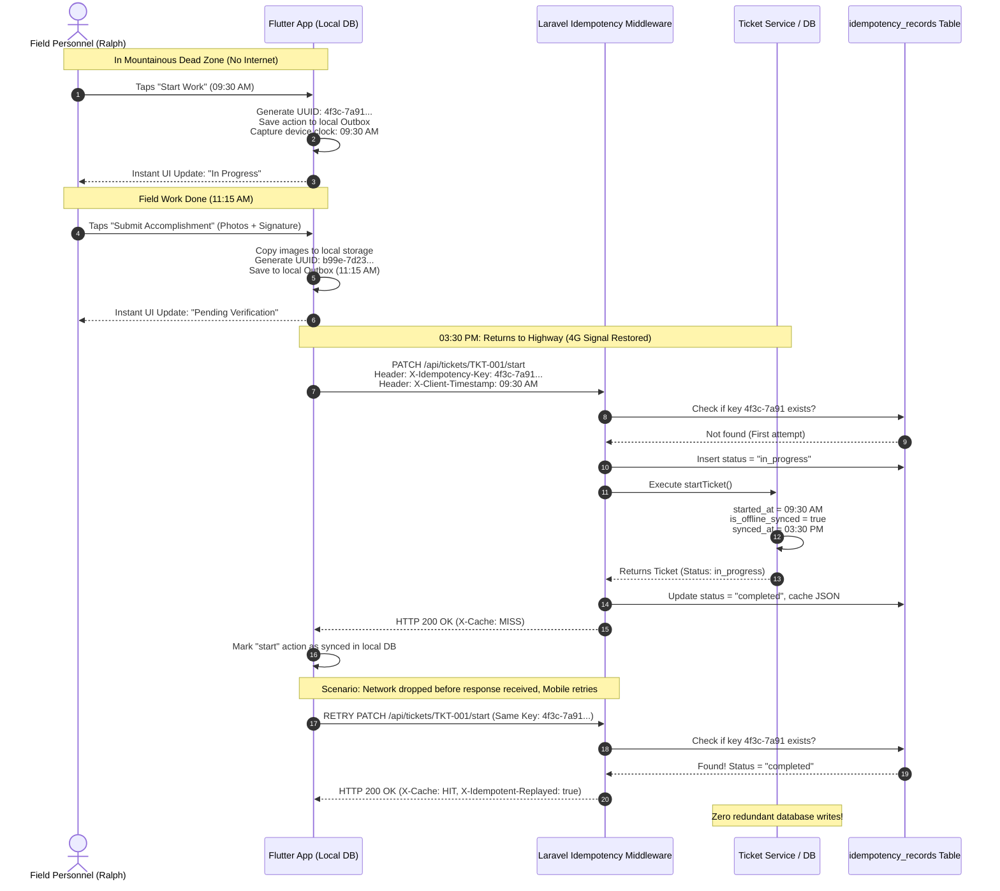
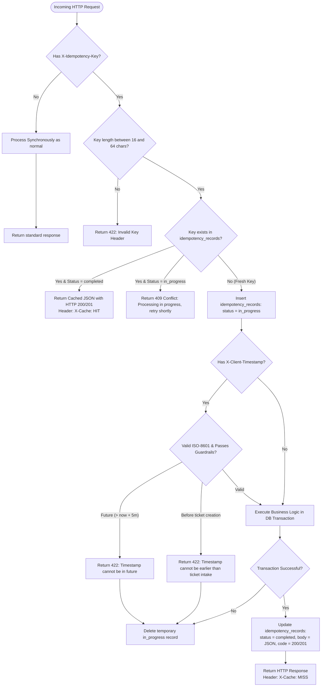

# PALECO OTRS-CRM: Offline-Asynchronous Module — Conceptual Guide & Deep Dive

**Document Version:** 1.0  
**Target Audience:** System Architects, Backend Developers, Mobile (Flutter) Engineers, Capstone Panelists  
**Scope:** Deep conceptual, mathematical, and technical explanation of the Field Personnel Offline-Asynchronous Architecture

---

## Table of Contents
1. [The Real-World Problem: The Lineman in the Mountains](#1-the-real-world-problem-the-lineman-in-the-mountains)
2. [The Core Philosophy: Three Foundational Concepts](#2-the-core-philosophy-three-foundational-concepts)
3. [Visual Architecture & Flowcharts](#3-visual-architecture--flowcharts)
4. [Justification of Design Decisions & Thresholds](#4-justification-of-design-decisions--thresholds)
5. [Code Walkthrough: What Happens Under the Hood](#5-code-walkthrough-what-happens-under-the-hood)
6. [Failure Modes & Edge Cases: How the System Handles Chaos](#6-failure-modes--edge-cases-how-the-system-handles-chaos)
7. [Glossary & Architectural Summary](#7-glossary--architectural-summary)

---

## 1. The Real-World Problem: The Lineman in the Mountains

To understand why this module exists, imagine the daily reality of a PALECO field personnel crew:

```
┌────────────────────────────────────────────────────────────────────────┐
│                        A DAY IN THE LIFE OF RALPH                      │
│                                                                        │
│  08:00 AM ──> Receives dispatch in Puerto Princesa Town Center         │
│               [4G LTE Connected] Ticket #001 is ASSIGNED               │
│                                                                        │
│  09:30 AM ──> Arrives in a mountainous Sitio with ZERO cell signal     │
│               [DEAD ZONE] Needs to START work                          │
│                                                                        │
│  11:15 AM ──> Work finished: Replaced blown transformer fuse           │
│               Takes 2 photo evidences & consumer signature             │
│               [DEAD ZONE] Needs to ACCOMPLISH ticket                   │
│                                                                        │
│  03:30 PM ──> Crew drives back down the highway into cellular range    │
│               [4G LTE Restored] Mobile phone uploads queued packets    │
└────────────────────────────────────────────────────────────────────────┘
```

### What Happened in the Old (Synchronous) System?
In a standard web API without offline-asynchronous support, three catastrophic failures occur in this scenario:

| Failure Mode | What Happened | Real-World Impact |
| :--- | :--- | :--- |
| **1. Immediate App Freeze / Crash** | When Ralph taps "Start Work" at 9:30 AM with no cellular tower in reach, the HTTP client hangs for 60 seconds, throws a `SocketException: Connection timed out`, and blocks the app. Ralph cannot use the app in the field. | The mobile app is unusable in dead zones. |
| **2. Falsified SLA & Timestamps** | If Ralph waits until 3:30 PM to tap "Start" and "Accomplish" when signal returns, the server sets `started_at = 3:30 PM` and `accomplished_at = 3:30 PM`. | **SLA metrics are corrupted.** Management thinks a 2-hour repair took 0 seconds, and response time metrics are ruined. |
| **3. The "Ghost Duplicate" Error** | While driving back, Ralph's phone gets a momentary 1-bar signal. The app sends "Start". The server executes it, but the tower drops before the HTTP `200 OK` gets back to the phone. The phone retries. The server throws: `422 Unprocessable Content: "This ticket is already in progress"`. | The mobile sync engine gets stuck in an infinite error loop. |

---

## 2. The Core Philosophy: Three Foundational Concepts

To solve this without corrupting relational integrity, the module introduces three enterprise software concepts:

```
┌───────────────────────────────────────────────────────────────────────────┐
│                        THE 3 FOUNDATIONAL CONCEPTS                        │
│                                                                           │
│   1. IDEMPOTENCY            2. EVENT-TIME DECOUPLING    3. THE OUTBOX     │
│      "Elevator Button"         "Wristwatch vs Wall Clock"  "Postal Box"   │
│                                                                           │
│   Pressing a button 10      The moment an event         Write letters,    │
│   times produces the exact  happened in the field is    save in a box,    │
│   same result as pressing   distinct from the moment    send one-by-one   │
│   it once.                  the server learned of it.   when mail opens.  │
└───────────────────────────────────────────────────────────────────────────┘
```

### Concept 1: Idempotency (IETF Specification)
* **The Analogy:** If you press the elevator button for Floor 5 once, the elevator comes to Floor 5. If you press it 10 times in rapid succession, the elevator still comes to Floor 5 only once. It does not send 10 elevators.
* **In PALECO:** When Ralph taps "Accomplish", his phone generates a unique UUID v4 ticket (e.g. `4f3c7a91-2a62-4b78-831d-b3ef9a82c401`). This is sent via `X-Idempotency-Key`.
* If a network timeout occurs and Ralph's phone retries 5 times, the server recognizes the UUID on the 2nd through 5th tries. It **does not re-execute the business logic**, does not upload duplicate photos, and does not create duplicate status logs. It simply hands back the cached successful `201 Created` response.

### Concept 2: Event-Time vs Ingestion-Time Decoupling
In distributed computing, there are two distinct clocks:
1. **Event Time (`X-Client-Timestamp`):** The exact instant the physical action took place on the lineman's wristwatch in the mountains (e.g. `11:15 AM`).
2. **Ingestion Time (`synced_at = now()`):** The instant the packet physically reached PALECO's cloud database (e.g. `3:30 PM`).

> **Why this matters:**  
> The system records `started_at` and `accomplished_at` using **Event Time** (keeping SLA analytics 100% honest to the actual work done), while marking `is_offline_synced = true` and `synced_at = 3:30 PM` so supervisors can clearly see that this report was filed from a remote dead zone and synced later.

### Concept 3: The Client-Side Outbox Pattern
The mobile app never makes a raw network call directly from a UI button tap.  
Instead:
1. When Ralph taps "Start", the app immediately writes an `OfflineAction` record into its local database (`Isar` / `Hive`).
2. The UI instantly updates (**Optimistic UI**), letting Ralph continue his job.
3. A background synchronization worker polls the local database. When real internet is available, it sends actions **First-In, First-Out (FIFO)** per ticket.

---

## 3. Visual Architecture & Flowcharts

### 3.1 End-to-End Sequence Diagram



---

### 3.2 Request Ingestion Flowchart (Backend Engine)



---

## 4. Justification of Design Decisions & Thresholds

Every number, rule, and constraint in this module was chosen for specific mathematical, operational, and network reasons:

### 4.1 Why the 5-Minute Threshold for `is_offline_synced`?
**The Rule:** If `X-Client-Timestamp` differs from `now()` by **more than 5 minutes**, the server flags `is_offline_synced = true`. If within 5 minutes, it is flagged as real-time (`false`).

**The Justification:**
1. **Network Propagation & Radio Latency:** Even on a sluggish 3G mobile connection, an HTTP TLS handshake and multipart form upload takes between 2 to 45 seconds.
2. **The "Coffee Break" Separation:** If an action reaches the server within 2 to 3 minutes, the lineman was still in cellular reach when tapping the button.
3. If an action is delivered 6, 30, or 180 minutes later, it represents a **physical travel delay** through an unserviced geographical corridor. Five minutes provides a mathematically safe boundary separating network transmission jitter from true remote offline operations.

---

### 4.2 Why the Future Guardrail (`now() + 5 minutes`)?
**The Rule:** If `X-Client-Timestamp` is more than 5 minutes ahead of the server's clock, the server rejects it with `422 Unprocessable Content: "The client timestamp cannot be in the future."`

**The Justification:**
1. **Preventing Lineman Fraud / Clock Manipulation:** Without this guardrail, a field worker could manually change their phone's clock to tomorrow at 5:00 PM to fake completion deadlines.
2. **Hardware Clock Drift Toleration:** Why not `now() + 0 seconds`? Because low-cost Android field phones frequently suffer from un-synchronized NTP clocks or quartz crystal oscillator drift by 30 to 120 seconds. Allowing a 5-minute future buffer tolerates minor phone clock inaccuracy without opening the door to date fabrication.

---

### 4.3 Why the Past Guardrail (`client_timestamp >= ticket creation`)?
**The Rule:** A client timestamp cannot be earlier than the ticket's intake date (`reported_at ?? created_at`).

**The Justification:**
* **Causal Order Invariant:** A complaint cannot physically be resolved before the consumer has even experienced the problem and filed the ticket. This preserves relational causality in legal audits and ERC (Energy Regulatory Commission) regulatory investigations.

---

### 4.4 Why a Dedicated `idempotency_records` Table (Not Just Redis or DB Unique Locks)?
**The Question:** Why didn't we just use a database unique index or Redis cache?

**The Justification:**
1. **Persistence Across Crashes:** If the local CRM server restarts or experiences a power interruption, Redis in-memory caches can be evicted. The MySQL table guarantees durability.
2. **The "Post-Commit Network Drop" Problem:**  
   Consider this timeline:
   - Request reaches server $\rightarrow$ Server inserts accomplishment report into `ticket_accomplishments` $\rightarrow$ Database transaction commits $\rightarrow$ **Cellular connection instantly breaks before HTTP response packets reach the phone.**
   - If the mobile phone replays the request without an idempotency cache, the server tries to re-insert. Without our cache, it would throw: *"This ticket already has a pending accomplishment report"*!
   - Because `idempotency_records` persists the exact generated JSON response and status code, the replayed request receives the original response smoothly, unlocking the phone's outbox.

---

### 4.5 Why a 7-Day Expiration (`expires_at`)?
**The Rule:** Idempotency records are kept for 7 days before being eligible for automated cleanup.

**The Justification:**
* In Palawan island operations (e.g. Cuyo, Cagayancillo, Coron outposts), emergency technical crews may embark on multi-day field expeditions on boats or mountainous feeder lines without reaching headquarters for up to a week. A 7-day retention window ensures no offline action loses its idempotency protection before the crew returns to base.

---

## 5. Code Walkthrough: What Happens Under the Hood

### Component 1: The Idempotency Middleware ([`HandleIdempotency.php`](file:///c:/Users/allen/Desktop/Capstone/-NEW-CRM-PALECO/PALECO_OTRS-CRM/app/Http/Middleware/HandleIdempotency.php))
When an HTTP request hits the `/start` or `/accomplish` route:
```php
// 1. If no header is sent, pass through normally (backward compatibility)
$idempotencyKey = $request->header('X-Idempotency-Key');
if (! $idempotencyKey) {
    return $next($request);
}

// 2. Look up the key scoped to the authenticated lineman
$record = IdempotencyRecord::where('user_id', $user->id)
    ->where('idempotency_key', $idempotencyKey)
    ->first();

// 3. If found and completed, short-circuit and return cached JSON!
if ($record && $record->status === 'completed') {
    return response()->json($record->response_body, $record->response_code)
        ->header('X-Cache', 'HIT')
        ->header('X-Idempotent-Replayed', 'true');
}
```

---

### Component 2: The Timestamp Guardrail ([`ResolvesClientTimestamp.php`](file:///c:/Users/allen/Desktop/Capstone/-NEW-CRM-PALECO/PALECO_OTRS-CRM/app/Http/Controllers/Api/Concerns/ResolvesClientTimestamp.php))
Before modifying database rows, the controller validates the timestamp:
```php
// Check future drift
if ($parsed->isAfter(now()->addMinutes(5))) {
    throw ValidationException::withMessages([
        'client_timestamp' => 'The client timestamp cannot be in the future.',
    ]);
}

// Check creation barrier
$ticketCreated = $ticket->reported_at ?? $ticket->created_at;
if ($ticketCreated && $parsed->isBefore($ticketCreated)) {
    throw ValidationException::withMessages([
        'client_timestamp' => 'The client timestamp cannot be earlier than ticket creation date.',
    ]);
}
```

---

### Component 3: Service-Level Idempotency Safety ([`TicketService.php`](file:///c:/Users/allen/Desktop/Capstone/-NEW-CRM-PALECO/PALECO_OTRS-CRM/app/Services/Tickets/TicketService.php#L415-L455))
Even if a request somehow bypassed the middleware cache, the service itself defends against state collision:
```php
public function startTicket(Ticket $ticket, User $worker, ?Carbon $clientTimestamp = null): Ticket
{
    return DB::transaction(function () use ($ticket, $worker, $clientTimestamp) {
        $lockedTicket = Ticket::where('id', $ticket->id)->lockForUpdate()->firstOrFail();

        // Idempotency safety: If already IN_PROGRESS, return ticket safely without throwing 422!
        if ($lockedTicket->status === TicketStatus::IN_PROGRESS) {
            return $lockedTicket->fresh(['category']);
        }

        // Apply offline timestamps
        $isOffline = $clientTimestamp !== null && $clientTimestamp->diffInMinutes(now()) > 5;
        $actualStartTime = $clientTimestamp ?? now();

        $lockedTicket->update([
            'status' => TicketStatus::IN_PROGRESS,
            'started_at' => $actualStartTime,
            'client_started_at' => $clientTimestamp,
            'is_offline_synced' => $isOffline,
            'synced_at' => $isOffline ? now() : null,
        ]);
        
        return $lockedTicket->fresh(['category']);
    });
}
```

---

## 6. Failure Modes & Edge Cases: How the System Handles Chaos

| Edge Case / Chaos Scenario | What Happens | How the System Defends Itself |
| :--- | :--- | :--- |
| **Lineman has two phones, taps "Start" simultaneously on both** | Both send the same UUID key in parallel threads. | MySQL's `UNIQUE(user_id, idempotency_key)` index blocks one with a unique key collision. The middleware catches the collision and returns `409 Conflict: "Request currently processing, please retry shortly."` |
| **Request fails validation (e.g. Lineman forgot to attach a signature)** | The server returns `422 Unprocessable Content`. | The middleware automatically **deletes** the temporary `in_progress` record. The mobile phone can immediately re-submit with the missing signature using the same key without being locked out. |
| **Connection drops mid-upload of 10 photos** | The server receives a partial HTTP payload and aborts the connection. | PHP catches the aborted request. No database records are committed. When the mobile app retries, the fresh full upload proceeds normally. |
| **Battery dies on phone during sync** | The phone shuts down before marking the action as synced locally. | When the phone boots up, the FIFO queue resends the action with the same `X-Idempotency-Key`. The server returns `200/201 (X-Cache: HIT)`, and the app safely clears its outbox. |

---

## 7. Glossary & Architectural Summary

| Term | Definition |
| :--- | :--- |
| **Idempotency** | The property of an operation whereby it can be applied multiple times without changing the result beyond the initial application. |
| **UUID v4** | A 128-bit universally unique identifier generated pseudo-randomly with virtually zero probability of collision across millions of devices. |
| **Event Time** | The timestamp of when an event physically occurred on the user's client device. |
| **Ingestion Time** | The timestamp of when the event's data packet was received and stored by the database server. |
| **Clock Drift** | The phenomenon where physical hardware clocks gradually desynchronize from standard UTC time. |
| **FIFO (First-In, First-Out)** | A queue processing discipline where the oldest stored action is processed before newer actions, guaranteeing causal sequence. |
| **Optimistic UI** | A frontend design pattern where the user interface immediately shows an action as completed before the backend network confirmation arrives. |

---

> [!NOTE]
> **Summary for Capstone Defense / Technical Presentations:**  
> This module guarantees that field dispatch operations adhere to **strict ACID properties** across distributed mobile devices operating in disconnected network environments. By combining **IETF Idempotency Keys**, **Event-Time Preservation**, and **FIFO Client Outboxes**, PALECO CRM eliminates duplicate transactions, guarantees accurate SLA auditing, and ensures 100% operational uptime for linemen in remote corridors of Palawan.

