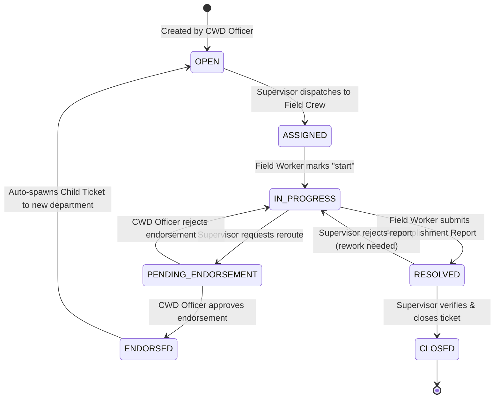

# PALECO OTRS-CRM: System Architecture, Features & Technical Specification

**System Name:** Palawan Electric Cooperative Online Ticket Resolution System & Customer Relationship Management (PALECO OTRS-CRM)  
**Version:** 1.3.0 (Post Backend Audit, Domain-Driven Architectural Restructure & Concurrency Hardening)  
**Framework:** Laravel 13.x / PHP 8.4+  
**Target Environments:** Web Administrative & Operational Desk (Blade + Livewire 4 + Tailwind CSS) | Mobile Field Application (Flutter via Laravel Sanctum REST API)  
**Date:** October 2026  

---

## Table of Contents
1. [Executive Summary & System Purpose](#1-executive-summary--system-purpose)
2. [High-Level Architecture & Domain-Driven Layering](#2-high-level-architecture--domain-driven-layering)
3. [Actor Profiles & Role-Based Access Control (RBAC)](#3-actor-profiles--role-based-access-control-rbac)
4. [Ticket Lifecycle & Finite State Machine](#4-ticket-lifecycle--finite-state-machine)
5. [Core Functional Modules & Scope](#5-core-functional-modules--scope)
   - [5.1 Consumer Welfare Desk (CWD) Web Portal](#51-consumer-welfare-desk-cwd-web-portal)
   - [5.2 Dedicated Manual Child Ticket Module](#52-dedicated-manual-child-ticket-module)
   - [5.3 Ticket Endorsement & Inter-Departmental Routing](#53-ticket-endorsement--inter-departmental-routing)
   - [5.4 Field Accomplishment & Verification Module](#54-field-accomplishment--verification-module)
   - [5.5 External Billing CRM Integration](#55-external-billing-crm-integration)
   - [5.6 Admin Management Portal](#56-admin-management-portal)
   - [5.7 Real-Time Sockets & Live Desk Broadcasting](#57-real-time-sockets--live-desk-broadcasting)
   - [5.8 Audit Trail & System Activity Monitoring](#58-audit-trail--system-activity-monitoring)
6. [Cross-Cutting Concerns & Security Architecture](#6-cross-cutting-concerns--security-architecture)
   - [6.1 Centralized Spatie Auditing (`Auditable.php`)](#61-centralized-spatie-auditing-auditablephp)
   - [6.2 Authentication Security & Rate Limiting (`HandlesAuthSecurity.php`)](#62-authentication-security--rate-limiting-handlesauthsecurityphp)
7. [Mobile REST API Specification](#7-mobile-rest-api-specification)
   - [7.1 Authentication & Security Contracts](#71-authentication--security-contracts)
   - [7.2 Supervisor Endpoints](#72-supervisor-endpoints)
   - [7.3 Field Personnel Endpoints](#73-field-personnel-endpoints)
8. [Database Schema & Performance Optimization](#8-database-schema--performance-optimization)
   - [8.1 Entity Blueprint & Relationships](#81-entity-blueprint--relationships)
   - [8.2 Performance Indexing Strategy](#82-performance-indexing-strategy)
   - [8.3 Developer Seeders & Relational Ordering](#83-developer-seeders--relational-ordering)
9. [Concurrency, Transactions & Integrity Guarantees](#9-concurrency-transactions--integrity-guarantees)

---

## 1. Executive Summary & System Purpose

The **PALECO OTRS-CRM** is a centralized utility management platform designed to automate and digitize the end-to-end lifecycle of electric cooperative service requests, power outages, metering problems, and technical complaints for the **Palawan Electric Cooperative (PALECO)**.

### Problems Solved:
* **Elimination of Paper Bottlenecks:** Replaces physical dispatch slips and manual logbooks with digital ticket intake and automated dispatch queues.
* **Inter-Departmental Friction Resolution:** Handles multi-departmental technical complaints seamlessly via an **Endorsement Pipeline** and a **Dedicated Child Ticket Module**.
* **Field Proof Accountability:** Mandates geotagged/time-stamped accomplishment photo uploads and consumer digital signatures before tickets can be closed.
* **External Billing Synchronization:** Connects in real-time with PALECO's external consumer billing database (`api.paleco.net`) to verify account codes and link customer historical data with a 7-day resilient cache and offline fallback.
* **Strict Auditability:** Captures every status change, team assignment, user modification, and authentication attempt with client IP and User-Agent attribution.

---

## 2. High-Level Architecture & Domain-Driven Layering

The system is engineered following a **Clean Layered, Domain-Driven Architecture** with an absolute boundary between the Stateful Web Portal and the Stateless Mobile API:

```
                               ┌──────────────────────────────────────────────┐
                               │               INCOMING REQUEST               │
                               └──────────────────────────────────────────────┘
                                                       │
                           ┌───────────────────────────┴───────────────────────────┐
                           ▼                                                       ▼
            [WEB PORTAL (Browser Sessions)]                         [MOBILE REST API (Flutter App)]
            - Cookie Auth + CheckIfActive Middleware                - Stateless auth:sanctum (Bearer)
            - Gate: access-admin / access-cwd_officer               - Gate: access-supervisor / access-field_personnel
            - Obscurity: Response::denyAsNotFound() (404)           - Obscurity: Response::denyAsNotFound() (404)
                           │                                                       │
                           └───────────────────────────┬───────────────────────────┘
                                                       │
                                                       ▼
                                      [FORM REQUEST VALIDATION LAYER]
                                      app/Http/Requests/{Domain}/*
                                      - Auth, Categories, Departments, Teams, Tickets, Users
                                      - Unified rules across Web & Mobile channels
                                      - prepareForValidation() sanitization & custom messages
                                                       │
                                                       ▼
                                      [THIN CONTROLLER ORCHESTRATION]
                                      - app/Http/Controllers/Web/*
                                      - app/Http/Controllers/Api/*
                                      - Orchestrates authorization & invokes Domain Services
                                                       │
                                                       ▼
                                      [DOMAIN SERVICE BUSINESS LAYER]
                                      app/Services/{Domain}/*
                                      - ActivityLogs, Auth, Categories, Consumers, Dashboard,
                                        Departments, External, Teams, Tickets, Users
                                      - DB::transaction(), lockForUpdate(), retry loops
                                      - Deferred event dispatching via DB::afterCommit()
                                                       │
                                                       ▼
                                      [CROSS-CUTTING CONCERNS & DRY TRAITS]
                                      app/Concerns/*
                                      - Auditable: Centralized Spatie Activitylog handling
                                      - HandlesAuthSecurity: Rate-limiting & DB lockout logic
                                                       │
                                                       ▼
                                      [ELOQUENT DATA MODELS & PERFORMANCE]
                                      - ULID primary keys for transactional tables
                                      - Auto-increment BigInt for catalog/lookup tables
                                      - 7 composite & single-column database performance indexes
                                                       │
                           ┌───────────────────────────┴───────────────────────────┐
                           ▼                                                       ▼
                [BLADE & LIVEWIRE 4 VIEWS]                                  [JSON RESOURCE MAPPING]
                - Tailwind CSS Layouts                                      - app/Http/Resources/Api/*
                - Livewire Echo socket listeners                            - Zero raw models returned
                - Tom Select dynamic controls                               - Standard ISO & display dates
```

---

## 3. Actor Profiles & Role-Based Access Control (RBAC)

The application defines four distinct system roles (`account_roles` table) governed by authorization gates in `AppServiceProvider`:

| Role Identifier (`slug_identifier`) | Primary Client Channel | Portal Privileges & Operational Scope |
| :--- | :--- | :--- |
| **`admin`** | **Web Browser Only** | System Administration. Full CRUD over Users, Departments, Teams, and Ticket Categories. Monitors global audit trail via System Monitoring. |
| **`cwd_officer`** | **Web Browser Only** | Consumer Welfare Desk. Ticket intake, live external billing verification, manual child ticket spawning, endorsement adjudication, accomplishment review, and real-time operations dashboard. |
| **`supervisor`** | **Mobile API (Flutter / Postman)** | Technical Foreman / Division Supervisor. Department-scoped ticket inbox. Assigns tickets to field teams, initiates inter-departmental endorsements to CWD, and reviews/approves/rejects field completion proofs. |
| **`field_personnel`** | **Mobile API (Flutter / Postman)** | Linemen & Technical Field Crews. Team-scoped ticket inbox. Acknowledges tickets (`start` work), executes repairs, and submits completion reports with photos, remarks, and consumer signatures. |

> **Security Guard:** Web-only administrative roles (Admin, CWD) attempting to log in via mobile API endpoints are rejected (`403 Forbidden`). Unauthorized access to privileged routes returns HTTP `404 Not Found` via `Response::denyAsNotFound()` to prevent route enumeration.

---

## 4. Ticket Lifecycle & Finite State Machine

Every ticket progresses through an explicit, strictly auditable state machine (`App\Enums\TicketStatus`):



### Ticket Status Definitions:
1. **`open`:** Registered at the CWD desk and queued for departmental assignment.
2. **`assigned`:** Assigned by a supervisor to a technical field team. Previous open assignments are timestamped with `unassigned_at = now()`.
3. **`in_progress`:** Field personnel have acknowledged the ticket and commenced active repair work.
4. **`pending_endorsement`:** Work halted; request submitted to CWD to reroute the ticket to another division.
5. **`endorsed`:** Endorsement approved by CWD; parent ticket marked endorsed, active team assignment closed, and a child ticket auto-spawned to the new department.
6. **`resolved`:** Technical field work completed; accomplishment report with photos and signature submitted and awaiting supervisor review.
7. **`closed`:** Supervisor has verified the completion proof. Active assignment timestamps finalized (`unassigned_at = now()`). Ticket permanently archived as completed.

---

## 5. Core Functional Modules & Scope

### 5.1 Consumer Welfare Desk (CWD) Web Portal
* **Intake Channels Supported:** Walk-In, Call-In, Hotline, Social Media, Radio, Field Discovery (`App\Enums\ComplaintSources`).
* **Dynamic Categorization:** Standard catalog categories or custom unlisted categories (`other_category = true`) with synchronized input controls.
* **Geographical Incident Tagging:** Structured address intake (Purok, Street, Barangay, Landmark).
* **Sequential Numbering:** Automated generation of `TKT-YYMMDD-###` (e.g., `TKT-261007-001`) with sequence retry loops and child ticket sequence isolation.

### 5.2 Dedicated Manual Child Ticket Module
* **Independent Sub-Task Order System:** Allows CWD officers to manually spawn subordinate tickets from any existing ticket when work requires multi-phase intervention.
* **Decoupled Lifecycle Guarantee:** Closing a child ticket does not close the parent ticket; closing a parent ticket does not force-close child tickets.
* **Hierarchical Numbering:** Child tickets branch from the parent ticket number:  
  $\text{Parent: } \texttt{TKT-261007-001} \implies \text{Children: } \texttt{TKT-261007-001-1}, \;\; \texttt{TKT-261007-001-2}$
* **UI Hierarchy Representation:** Dedicated hierarchy tree displaying parent/child linkages, status badges, and quick navigation.

### 5.3 Ticket Endorsement & Inter-Departmental Routing
* **Rerouting Mechanism:** Supervisors initiate an endorsement request with target department and reason.
* **Pessimistic Concurrency Protection:** Employs `lockForUpdate()` on `TicketEndorsement` and `Ticket` to prevent race conditions during concurrent officer evaluations.
* **Adjudication Decisions:**
  - **Approval:** Marks parent ticket `endorsed`, closes active team assignment (`unassigned_at = now()`), and auto-spawns a child ticket for the new department.
  - **Rejection:** Reverts parent ticket status back to its exact `pre_endorsement_status` and logs the `rejection_reason`.

### 5.4 Field Accomplishment & Verification Module
* **Field Evidence Collection:** Completion description, findings, customer signature image, and multiple accomplishment photos uploaded via `multipart/form-data`.
* **Supervisor Verification:**
  - **Approval:** Closes ticket (`closed`), sets `closed_at`, closes active assignment timestamp (`unassigned_at = now()`).
  - **Rejection:** Resets ticket status back to `in_progress` with mandatory `rejection_reason`.

### 5.5 External Billing CRM Integration
* **Live Consumer Lookup:** Connects to `https://api.paleco.net/api/v1/account/{accountCode}` via `ConsumerService`.
* **Resilient Caching & Offline Fallback:** Caches verified profiles for 7 days. If the billing API is unreachable, gracefully falls back to local database consumer records.

### 5.6 Admin Management Portal
* **Users:** Provisioning, BCrypt hashing, role assignment, departmental attachment, deactivation/reactivation.
* **Departments:** Full CRUD with soft deletion, restore, and delete protections.
* **Teams:** Creation, shift schedules, department alignment, roster member assignment, soft archiving, restoration, and permanent deletion with Route Model Binding `->withTrashed()`.
* **Ticket Categories:** Catalog management, description editing, and archival controls.

### 5.7 Real-Time Sockets & Live Desk Broadcasting
* **Stack:** Laravel Reverb WebSocket server + Laravel Echo.
* **Transaction Safety:** Broadcast events are wrapped in `DB::afterCommit()` ensuring WebSockets only emit once the database transaction commits successfully.
* **Null-Safety:** `TicketCreated` safely resolves department slugs (`$this->ticket->department?->slug ?? 'cwd'`) preventing null-pointer errors.

### 5.8 Audit Trail & System Activity Monitoring
* **Spatie Activitylog Integration:** Every mutating action is captured with dirty-attribute JSON diffs via the centralized `Auditable` trait.
* **Context Attribution:** Client IP address and HTTP User-Agent captured automatically on every log.

---

## 6. Cross-Cutting Concerns & Security Architecture

### 6.1 Centralized Spatie Auditing (`Auditable.php`)
Located at `app/Concerns/Auditable.php`, this trait eliminates over 150 lines of duplicate Spatie Activitylog configuration across `Department`, `Team`, `Ticket`, `TicketCategory`, and `User`.
- Automatically sets `useLogName()` to the model's table name.
- Enables `logOnlyDirty()` and `dontLogEmptyChanges()`.
- Differentiates between permanent deletion (`purged`) and soft-delete archiving (`archived`).
- Dynamically resolves entity titles (`ticket_number`, `team_name`, `dept_name`, `name`).
- Provides a customizable hook `getCustomActivityDescription()` for specialized audit events (e.g. user deactivation vs reactivation).

### 6.2 Authentication Security & Rate Limiting (`HandlesAuthSecurity.php`)
Located at `app/Concerns/HandlesAuthSecurity.php`, this trait unifies authentication security across Web and Mobile login services:
- **Database Lockout Enforcement:** Handles persistent account lockout when `locked_until > now()`.
- **IP Rate Limiting:** Enforces 5-attempt rate limits with automatic 15-minute database lockouts upon threshold breach.

---

## 7. Mobile REST API Specification

All mobile endpoints require:
```http
Accept: application/json
Authorization: Bearer <sanctum_token>
```

### 7.1 Authentication & Security Contracts
* `POST /api/login`: Authenticates mobile users (Supervisor / Field Personnel). Revokes prior tokens, applies 5-attempt rate limit and 15-minute lockouts.
* `POST /api/logout`: Revokes active Sanctum token.
* `GET /api/user/profile`: Retrieves authenticated user details, department, and team memberships.

### 7.2 Supervisor Endpoints
* `GET /api/dashboard`: Department-scoped metrics (open, assigned, in-progress, pending endorsement, resolved, closed).
* `GET /api/tickets`: Paginated ticket inbox with status counters (`meta.status_counts` single-query aggregation). Supports `search`, `category`, `status`, `sort`.
* `GET /api/tickets/{ticket}`: Detailed ticket information.
* `GET /api/tickets/{ticket}/assign-options`: Available department teams.
* `POST /api/tickets/{ticket}/assign`: Dispatches ticket to a team; closes previous assignment timestamp.
* `GET /api/tickets/{ticket}/endorse-options`: Candidate departments.
* `POST /api/tickets/{ticket}/endorse`: Submits inter-departmental endorsement request.
* `GET /api/tickets/{ticket}/history`: Assignment and endorsement history timeline.
* `POST /api/tickets/{ticket}/accomplishments/{accomplishment}/verify`: Approves (closes ticket) or rejects (reopens to in-progress).
* `GET|POST|PUT|DELETE /api/teams/*`: Complete CRUD, archival, restore, and force-deletion of department teams.

### 7.3 Field Personnel Endpoints
* `GET /api/tickets`: Team-scoped ticket inbox.
* `PATCH /api/tickets/{ticket}/start`: Acknowledges ticket and begins work (`in_progress`).
* `POST /api/tickets/{ticket}/accomplish`: Submits accomplishment report with work description, findings, photos, and signature (`resolved`).
* `GET|POST /api/tickets/{ticket}/remarks`: List and add ticket timeline remarks.

---

## 8. Database Schema & Performance Optimization

### 8.1 Entity Blueprint & Relationships

```
┌─────────────────────────────────┐           ┌─────────────────────────────────┐
│           departments           │ 1       * │              teams              │
│ PK: id (BigInt)                 ├───────────┤ PK: id (ULID)                   │
│ dept_name, dept_code, is_active │           │ department_id (BigInt)          │
└────────────────┬────────────────┘           │ team_name, shift_start/end      │
                 │ 1                          └────────────────┬────────────────┘
                 │                                             │ 1
                 │ *                                           │ *
┌────────────────┴────────────────┐           ┌────────────────┴────────────────┐
│             users               │ *       * │          team_members           │
│ PK: id (ULID)                   ├───────────┤ PK: id (BigInt)                 │
│ role_id, department_id          │           │ team_id (ULID), user_id (ULID)  │
│ username, email, is_active      │           │ team_role_id (BigInt)           │
└────────────────┬────────────────┘           └─────────────────────────────────┘
                 │ 1
                 │ *
┌────────────────┴──────────────────────────────────────────────────────────────┐
│                                   tickets                                     │
│ PK: system_id (ULID)                                                          │
│ ticket_number (TKT-YYMMDD-###), parent_ticket_id (ULID, nullable)             │
│ consumer_id (ULID, nullable), department_id (BigInt), team_id (ULID, nullable)│
│ category_id (BigInt, nullable), other_category, other_category_name           │
│ status (open, assigned, in_progress, pending_endorsement, endorsed, ...)      │
│ purok, street, barangay, landmark, complaint_description                      │
│ reported_at, started_at, resolved_at, closed_at                              │
└───────┬──────────────┬──────────────────┬─────────────────┬───────────────────┘
        │ 1            │ 1                │ 1               │ 1
        │ *            │ *                │ *               │ *
┌───────┴──────┐ ┌─────┴──────────┐ ┌─────┴───────────┐ ┌───┴───────────────────┐
│ticket_remarks│ │ticket_status_  │ │ticket_          │ │ticket_accomplishments │
│PK: id (ULID) │ │logs            │ │assignments      │ │PK: id (BigInt)        │
│body, internal│ │PK: id (BigInt) │ │PK: id (BigInt)  │ │work_desc, signature   │
└──────────────┘ └────────────────┘ │unassigned_at    │ │status (pending/app/rej│
                                    └─────────────────┘ └───────────┬───────────┘
                                                                    │ 1
                                                                    │ *
                                                        ┌───────────┴───────────┐
                                                        │ accomplishment_photos │
                                                        │ PK: id (BigInt)       │
                                                        │ file_path, file_name  │
                                                        └───────────────────────┘
```

### 8.2 Performance Indexing Strategy
Migration `2026_10_07_203000_add_performance_indexes_to_tickets_table.php` introduces 7 targeted indexes:
1. `idx_tickets_status` (`status`): Speeds up single-query status aggregations.
2. `idx_tickets_reported_at` (`reported_at`): Speeds up chronological sorting.
3. `idx_tickets_created_at` (`created_at`): Speeds up 7-day dashboard trend queries.
4. `idx_tickets_closed_at` (`closed_at`): Speeds up resolution metric calculations.
5. `idx_tickets_department_status` (`[department_id, status]`): Composite index for supervisor inbox queries.
6. `idx_tickets_team_status` (`[team_id, status]`): Composite index for field crew mobile queries.
7. `idx_tickets_status_reported_at` (`[status, reported_at]`): Composite index for queue priority sorting.

### 8.3 Developer Seeders & Relational Ordering
Master seeder (`DatabaseSeeder.php`) executes seeders in strict relational dependency:
1. `RoleSeeder`: Core system roles (`admin`, `cwd_officer`, `supervisor`, `field_personnel`).
2. `TeamRoleSeeder`: Pivot roles (`Team Leader`, `Team Member`, `Backup`).
3. `DepartmentSeeder`: 4 operational divisions (TSD, CWD, AOD, LCMD).
4. `TeamSeeder`: 4 field teams with shift times (Alpha, Bravo, Charlie, Delta).
5. `TicketCategorySeeder`: 8 common technical utility complaint categories.
6. `UserSeeder`: Pre-configured test accounts:
   - Admin: `allenglenn` / `password`
   - CWD Officer: `alliah` / `password`
   - Supervisor: `mycka` / `password` (Assigned to TSD)
   - Field Crew: `ralph` / `password` (Assigned to Alpha Crew)

---

## 9. Concurrency, Transactions & Integrity Guarantees

1. **Transaction Wrapping:** All multi-step database mutations are encapsulated inside `DB::transaction()`.
2. **Pessimistic Row Locking (`lockForUpdate()`):** Applied to ticket and endorsement records across assignment, start, accomplishment, endorsement, and verification workflows.
3. **Sequence Collision Retry:** Root ticket number generation incorporates a 3-attempt retry loop with exponential jitter to gracefully resolve simultaneous submission collisions.
4. **Sequence Isolation:** Root ticket sequence generator filters with `whereNull('parent_ticket_id')` to isolate arithmetic from child ticket numbers (e.g. `TKT-261007-005-1`).
5. **Open Assignment Lifecycle Tracking:** Transitioning a ticket via endorsement or completion automatically sets `unassigned_at = now()` on active assignment records.
6. **Deferred Broadcast Safety:** `DB::afterCommit()` ensures WebSocket events only dispatch after the database transaction successfully commits.
7. **Soft Delete Route Model Binding:** Soft-deletable resources like `teams` and `ticket_categories` utilize `->withTrashed()` in route definitions to enable type-hinted model binding across restore and purge operations.

---

## 10. Offline-Asynchronous API & Idempotency Architecture

To support field personnel operating in remote dead zones without cellular reception, the API incorporates an enterprise-grade offline-asynchronous synchronization engine.

### 10.1 Key Components
1. **Idempotency Middleware (`HandleIdempotency.php`):**
   - Intercepts mutating requests containing the `X-Idempotency-Key` header.
   - Checks `idempotency_records` table scoped to the authenticated user.
   - If an existing completed record is found, returns the cached JSON response and status code with header `X-Cache: HIT`.
   - If an in-progress request exists with the same key, responds with `409 Conflict`.
   - On initial execution, records an `in_progress` lock, processes the controller action, caches the resulting JSON response with `status = 'completed'`, and sets `expires_at = now() + 7 days`.
2. **Client Timestamp Trait (`ResolvesClientTimestamp.php`):**
   - Extracts `X-Client-Timestamp` header or `client_timestamp` request parameter.
   - Enforces chronological guardrails:
     - **Lower bound:** Timestamp must be $\ge$ `reported_at` (prevents time-travel before ticket existence).
     - **Upper bound:** Timestamp must be $\le$ `now() + 5 minutes` (prevents future clock manipulation while allowing 5-minute device clock drift).
3. **Event-Time Decoupling in Services (`TicketService` & `TicketAccomplishmentService`):**
   - If the difference between `client_timestamp` and server `now()` exceeds **5 minutes**, the request is classified as an offline store-and-forward sync.
   - Sets `is_offline_synced = true` and `synced_at = now()`.
   - Records physical SLA event times using the client timestamp (`started_at`, `client_started_at`, `accomplished_at`, `client_accomplished_at`).
4. **Defensive Service-Level State Fallbacks:**
   - Even if cache is missed or bypassed, `startTicket` returns an existing `IN_PROGRESS` ticket safely instead of throwing a `422` error.
   - `accomplishTicket` returns an existing accomplishment report if already completed by the same worker, guaranteeing complete network retry safety.
